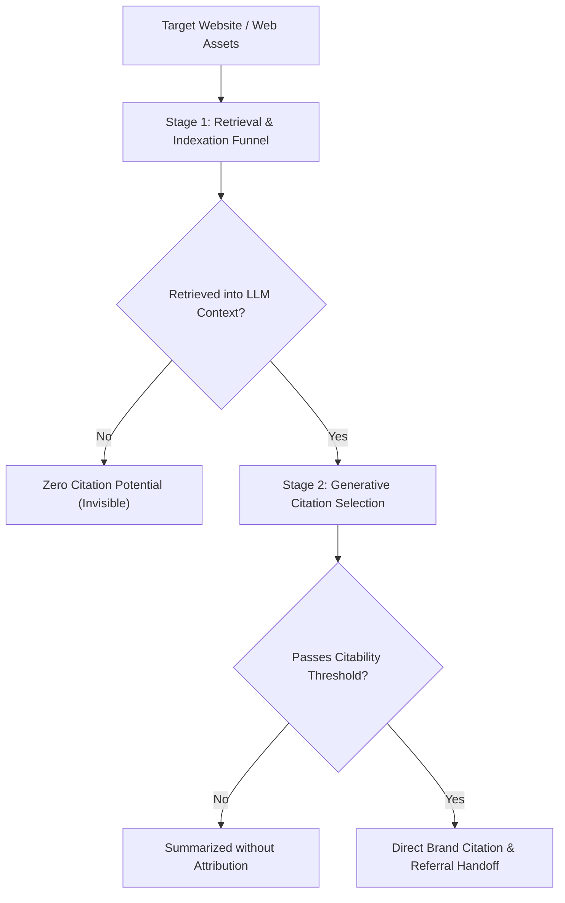

# Brand AI-Readiness Audit — Architecture

**Author:** Jayanth Reddy Konda
**Version:** 2.0.0
**Specification Compliance:** `agentskills.io` Standard & JSON Schema Draft-07

---

## 1. Core Architectural Philosophy: The AI Agent IS the Orchestrator

This system is a **True Agentic Marketplace**. There is no master Python runner that ties everything together. The AI Agent is the intelligent coordinator. Python scripts are pure, deterministic sensors.

```
┌─────────────────────────────────────────────────────────────────────┐
│                        AI AGENT (Reasoner)                          │
│                                                                     │
│  1. Reads SKILL.mds → Understands each domain's decision rules     │
│  2. Runs acquire_inventory.py → Gets typed HTML pages               │
│  3. Runs each of 6 specialist scripts → Collects raw telemetry      │
│  4. Applies cognitive reasoning → Deduplicates, root-causes, fixes  │
│  5. Writes final JSON → Validates with validate_report.py           │
└────────────────────────────┬────────────────────────────────────────┘
                              │
         ┌────────────────────┼──────────────────────┐
         ▼                    ▼                       ▼
   Orchestrator Tools    6 Specialist Skills    Validation Tool
   acquire_inventory.py  (each independent)    validate_report.py
   safe_fetch.py         SKILL.md              report-schema.json
                         _check.py
                         safe_fetch.py (own)
                         knowledge-base.md
```

### Two-Layer Separation of Concerns

| Layer | What It Contains | What It Does | What It Does NOT Do |
|---|---|---|---|
| **AI Cognitive Layer** | SKILL.md files, knowledge bases | Reads rules, runs scripts, reasons, synthesizes | Execute raw HTTP calls or parse HTML directly |
| **Deterministic Sensor Layer** | Python scripts (`_check.py`, `safe_fetch.py`) | Fetch HTML, extract facts, return structured JSON | Reason, deduplicate, or assign root causes |

This separation is fundamental. It means:
- **Scripts never go stale from domain knowledge changes** — only SKILL.md files need updating as the AI-SEO landscape evolves
- **Scripts are fully testable in isolation** — unit tests verify extraction accuracy without needing an AI
- **The AI's reasoning is transparent** — the AI explains its conclusions in natural language, not buried in Python logic

---

## 2. The Two-Stage AI Visibility Funnel

Modern generative search engines (ChatGPT Search, Perplexity Pro, Google AI Overviews, Claude) evaluate web content in two distinct, sequential phases:



**Stage 1 (Retrieval & Indexation):** Audited by `discoverability-audit` & `entity-content-audit`.
- robots.txt permissions for AI retrieval bots (OAI-SearchBot, PerplexityBot, Claude-SearchBot)
- noindex directives, HTTP status codes, raw HTML rendering completeness
- Schema.org `@graph` Organization and Product machine anchors

**Stage 2 (Generative Citation Selection):** Audited by `geo-content-audit`, `fact-consistency-audit`, `corroboration-authority-audit`, and `engagement-context-audit`.
- Empirical depth: 134–167 word passage chunks, causal conjunctions (because, due to, therefore)
- Grounded truth: Multi-page fact consistency, verified third-party authority node links (sameAs)

---

## 3. Skill Isolation & Modular Decomposition

Each skill has exactly one isolated responsibility and security boundary:

| Skill | Role | Isolated Responsibility |
|---|---|---|
| **audit-orchestrator** | Entrypoint | AI runbook — coordinates the full audit, validates the final report |
| **discoverability-audit** | Specialist | HTTP status, robots.txt bot matrix (RFC 9309), noindex directives, canonical consolidation, raw HTML extractability |
| **entity-content-audit** | Specialist | JSON-LD @graph extraction (Organization, Product), weighted Answerability attribute completeness |
| **fact-consistency-audit** | Specialist | Scoped first-party fact ledger, cross-page price & contact contradiction detection |
| **corroboration-authority-audit** | Specialist | The ONLY skill permitted to probe external sameAs links (Wikidata, LinkedIn, Wikipedia) |
| **geo-content-audit** | Specialist | Generative Engine Optimization (Princeton KDD 2024): causal depth, statistical evidence density, answer blocks |
| **engagement-context-audit** | Specialist | Post-citation continuity, Entity-to-H1 information scent, commercial CTA reachability |

---

## 4. Why Each Skill Ships Its Own `safe_fetch.py`

Each specialist skill ships an identical copy of `safe_fetch.py` in its `scripts/` directory. This is a deliberate `agentskills.io` portability requirement:

- **Independent deployability:** Any skill can be installed and run standalone without depending on sibling skills being present.
- **No import path assumptions:** A skill must not reach into another skill's directory to import shared code.
- **Security boundary enforcement:** Each skill's SSRF sandbox is self-contained. The orchestrator's `safe_fetch.py` governs `acquire_inventory.py`. Each specialist's `safe_fetch.py` governs its own network egress.

---

## 5. Black-Box CLI Execution Standard

Following the `agentskills.io` and Anthropic skill authoring guidelines:
- **No Source Code Ingestion:** The AI agent never reads Python script source code. It executes scripts as black-box CLI tools.
- **CLI Subprocess Invocations:** `python3 scripts/<check>.py --site <url> --inventory <inv> --format json`
- **Stream Separation:** Pure JSON data emits to `stdout`; diagnostic warnings emit to `stderr`.

---

## 6. Dual-Track Remediation

Every finding in the final report strictly conforms to the dual-track requirement:
- **`technical_fix`:** Concrete code patches, schema markup, or server configuration (for developers).
- **`creative_fix`:** Content rewriting guidelines, heading restructurings, or positioning adjustments (for copywriters/marketers).
- **`verification`:** Step-by-step instructions to validate the remediation resolved the defect.

---

## 7. Execution Timeline (< 5 Minutes)

| Phase | Duration | What Happens |
|---|---|---|
| Knowledge Loading (Phases 1) | ~0s (AI reads) | AI reads 3 orchestrator references + 6 specialist SKILL.mds |
| Inventory Acquisition | < 60s | `acquire_inventory.py` crawls up to 25 HTML pages |
| 6 Specialist Scripts | ~5–30s each | Each script runs, extracts telemetry, returns JSON |
| AI Synthesis | ~0s (AI reasons) | Deduplication, root-cause mapping, remediation writing |
| Validation | < 1s | `validate_report.py` confirms schema compliance |
