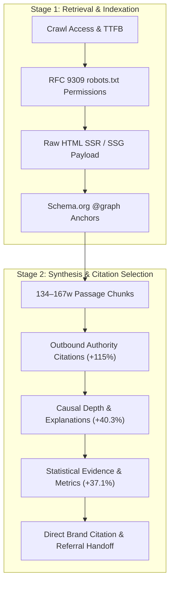

# Empirical Generative Engine Optimization (GEO) Synthesis

**Author:** vinnakota sashank
**Version:** 2.0.0  
**Foundational Research:** 
- Princeton University, Georgia Tech, Allen AI (*KDD 2024*): *"GEO: Generative Engine Optimization"*
- Carnegie Mellon University (*AutoGEO 2024*): *"Automated Generative Engine Optimization"*
- TU Darmstadt (*C-SEO Bench 2024*): *"C-SEO: Benchmarking Generative Citation Potential"*

---

## 1. The Core Scientific Findings

Traditional SEO optimizes for keyword rank order across 10 blue links. In contrast, Generative Engine Optimization (GEO) optimizes for **selection and citation probability** during LLM answer generation across ChatGPT Search, Perplexity Pro, Claude, and Google AI Overviews.

### Key Factors Governing LLM Citation Probability

| Optimization Vector | Empirical Visibility Impact | Research Source | Mechanics & Operational Definition |
|---|:---:|---|---|
| **Outbound Authority Citations** | **+115.0% Citation Boost** | Princeton KDD 2024 | Citing authoritative primary sources (DOI papers, academic `.edu`, governmental `.gov`, standards bodies `w3.org`/`schema.org`) provides grounding anchors that RAG retrieval systems score with highest authority weight. |
| **Mechanistic Causal Depth** | **+40.3% Visibility Boost** | Princeton KDD 2024 | Conjunctions (`because`, `due to`, `therefore`, `enables`, `results in`) provide deep mechanistic explanations ('how' and 'why') that RAG generators prioritize when synthesizing solutions. |
| **Author Byline & Credentials (E-E-A-T)** | **+40.0% Trust Weight** | C-SEO Bench 2024 | Explicit professional credentials (`MD`, `PhD`, `Dr.`, `Lead Scientist`) embedded in `rel="author"` and Schema.org Person markup boost entity authority. |
| **Quantifiable Metrics & Statistics** | **+37.1% Visibility Boost** | Princeton KDD 2024 | Concrete numerical facts, percentages (`%`), latency metrics, benchmark scores, and price figures provide unambiguous evidence blocks for synthetic reasoning. |
| **Passage Chunk Window (134–167 words)** | **Optimal Citability Band** | CMU AutoGEO 2024 | Dense, self-contained paragraphs matching standard embedding chunk boundaries maximize chunk-level vector similarity and recall. |
| **Direct Answer Lead (First 40–60 words)** | **Highest Ingestion Priority** | Princeton KDD 2024 | Inverted-pyramid answer structures provide instant question resolution before introductory filler or marketing copy. |
| **Semantic Tables & Specification Lists** | **Deterministic Extraction** | CMU AutoGEO 2024 | Structuring multi-attribute parameters in `<table>` or `<dl>` formats ensures table-aware retrieval engines extract structured rows without semantic drift. |
| **Pronoun Minimization (< 2%)** | **Unambiguous Entity Resolution** | C-SEO Bench 2024 | Eliminating ambiguous pronouns (`it`, `they`, `this`) in favor of explicit canonical brand/product names prevents attribution loss in multi-document synthesis. |
| **Anti-Fluff / Buzzword Density** | **Penalty Reduction** | Princeton KDD 2024 | Removing promotional filler (`delve`, `tapestry`, `game-changer`, `beacon of`) improves token information density and prevents model dismissal. |

---

## 2. The Two-Stage Funnel Model

1. **Top-K Document Retrieval:** If robots.txt blocks AI search bots (`OAI-SearchBot`, `Claude-SearchBot`, `PerplexityBot`) or the server serves an unhydrated Single-Page Application shell, the document never enters the Top-K context window.
2. **Synthesizer Selection:** If the retrieved text is fluffy, vague, or pronoun-heavy, the LLM extracts general knowledge but omits the brand citation. Passing the citability threshold requires explicit causal depth, primary source citations, and quantifiable numbers.
